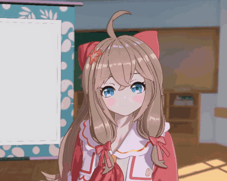
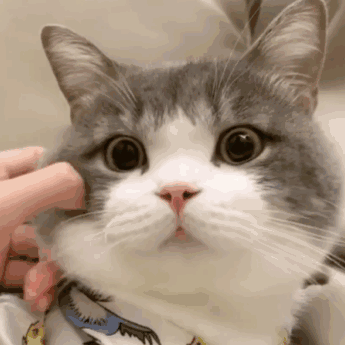

<h1 align="center">Hi 👋, I'm skr305</h1>
<h3 align="center">a noob frontend</h3>
### I'M A NOOB
however, there are many interesting things 

+ # be happy guy

### 每天都是活著的重要里程碑和不可或缺的節點
### Jokainen päivä on tärkeä virstanpylväs ja välttämätön elämän solmu
### 山の頂上に行く

> # say nice try to yourself 

- 🌱 I’m currently learning ...
- ⚡ Fun
- 😄 dadadada

<h3 align="left">Languages and Tools:</h3>

               

&nbsp;

> + ##### I love cat

<!--
**skr305/skr305** is a ✨ _special_ ✨ repository because its `README.md` (this file) appears on your GitHub profile.

Here are some ideas to get you started:

- 🔭 I’m currently working on ...
- 🌱 I’m currently learning ...
- 👯 I’m looking to collaborate on ...
- 🤔 I’m looking for help with ...
- 💬 Ask me about ...
- 📫 How to reach me: ...
- 😄 Pronouns: ...

-->

> ENJOY LIFE!